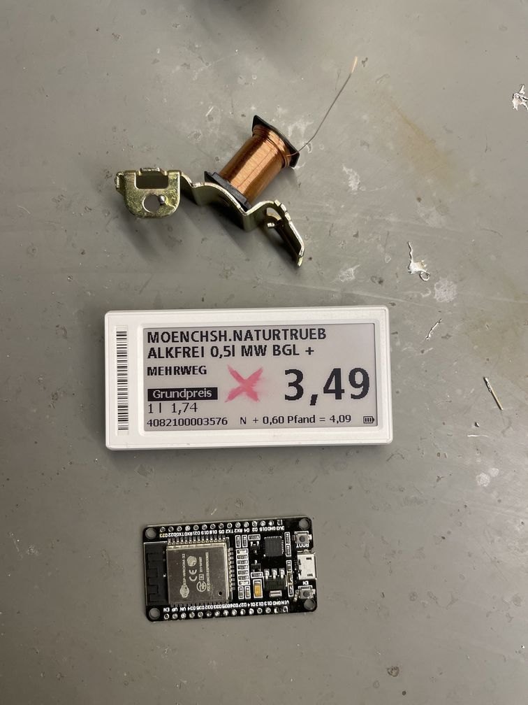
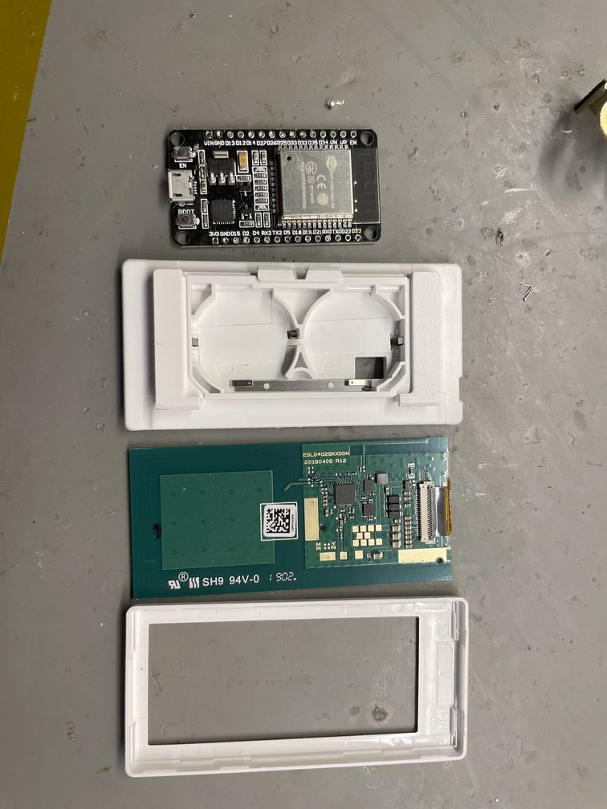
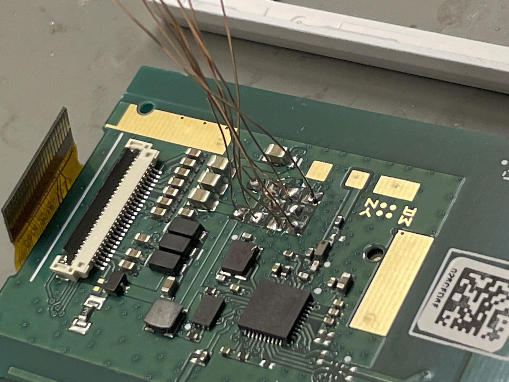
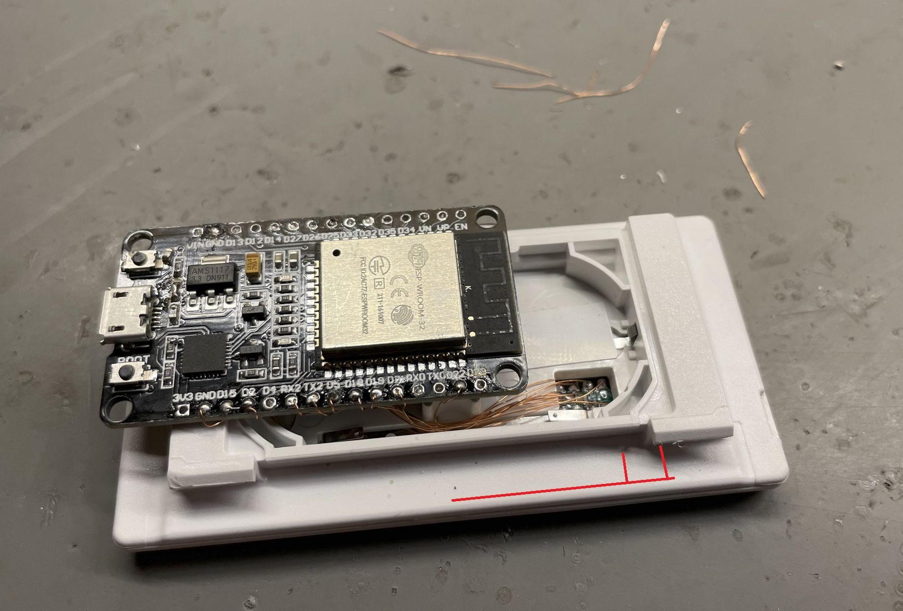

# How To Build an ESP32 e-paper-station.

You'll need
- ESP32
- Old solum pricetag, 1.54, 2.9 preferably one with a dodgy screen
- Some thin wires (I use coated copper wire from an old solenoid)

- Disassemble the picetag using a small (dull) knife or your nails and separate all the components. Shouldn't be too hard. Throw the batteries out or save them, whatever works for you. Be careful around small children with lithium cells

- Attach small wires to the points that are exposed through the little window in the back.

- All these pins (except for the Test/P1.0 pin) need to be hooked up to an ESP32. Make notes while you make the connections, so you can later check your work.
- Use your soldering tool and a little bit of solder to thermally strip the enamel of the copper wire.

- Be careful with the PCB: it's quite literally built down to a price, it's very thin/lightweight and pads can come off sorta easily. That'd be bad.

- Now guide the small copper wires though the hole in the battery bay, and guide the wires all the way to the top side and maybe close to an ESP32.
- Keep track of what you hook-up to what pads, and edit the pinout in settings.h

The zigbee antenna is indicated in red here. It sits to the side of the case, and is just a short strip of metal. If you can avoid placing the ESP32 directly over the battery, I'd strongly suggest you do so. Putting a wifi transmitter near the zigbee radio may cause poor performance. At the very least a wifi radio in close proximity will desensitize the front-end somewhat, leading to poor connections and packet loss, even if it's not using the same channel.
